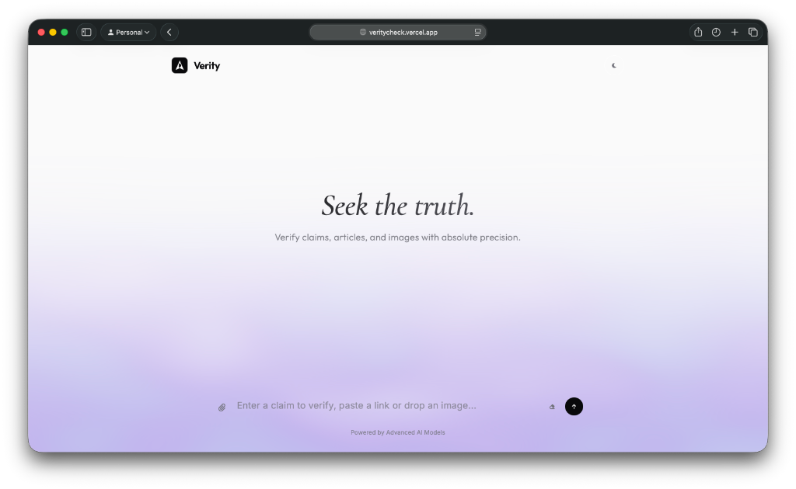
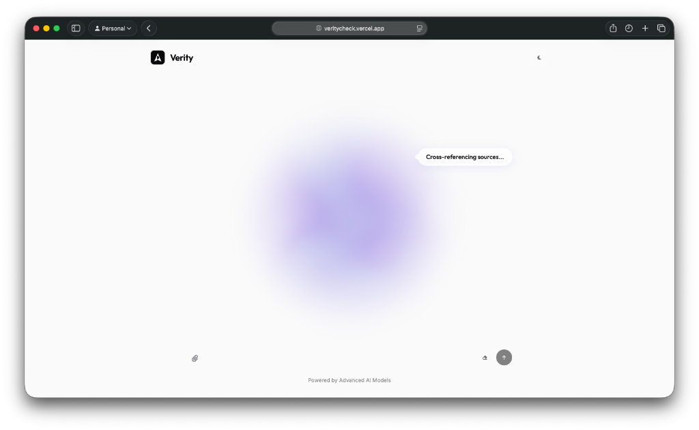
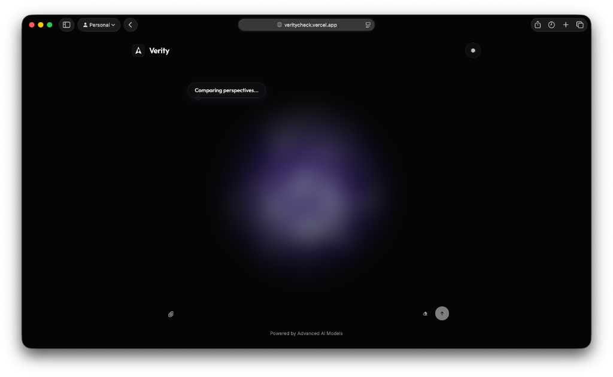
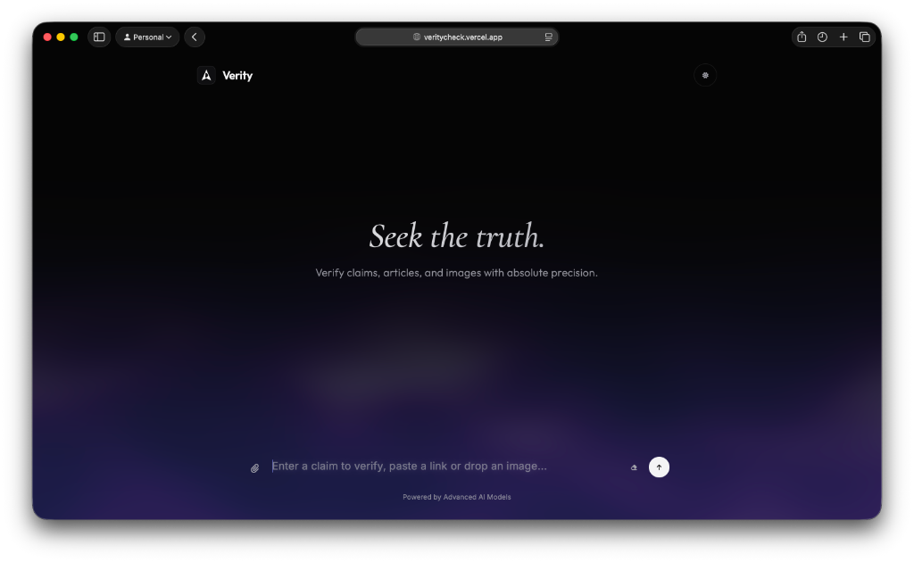

# Verity — Seek the Truth

Verity is a tool I built to verify online claims, articles, and images. Instead of just guessing, it combines fast AI models with real-time web search to give you clear verdicts backed by cited evidence, helping to cut through the noise of online misinformation.

<p align="center">
  
  
</p>
<p align="center">
  
  
</p>

## Features

- **Multi-modal Verification**: Fact-check raw text, drop in a web URL, or upload images directly to see what's real.
- **Chrome Extension Frontend**: A separate Manifest V3 extension can fact-check the visible post while you browse social media.
- **Web Extraction**: Built-in scrapers to pull clean content from:
  - **Social Media**: Custom adapters for social media sites like X/Twitter or reddit.
  - **Articles**: Reliable text extraction using `readability` and `BeautifulSoup`.
- **Hybrid AI Architecture**:
  - **Groq (Primary)**: Handles the fast inference using Llama 3.3-70b and Llama 4.
  - **Google Gemini (Grounding)**: Steps in for the heavy reasoning and real-time Google Search grounding.
- **Evidence Grounding**: It doesn't just give a verdict. Every check includes a confidence score and the actual source URLs.
- **The UI**: A responsive, dark-mode-first frontend. I added some Three.js particle clouds for the background.

## Tech Stack

- **Backend**: Python, Flask, BeautifulSoup4, Readability.js (Python port), Requests.
- **Frontend**: HTML5, Vanilla CSS, Vanilla JavaScript, Three.js (WebGL).
- **AI Infrastructure**: Groq API, Google Gemini API.
- **Deployment**: Optimized for Vercel.

## Installation

### Prerequisites
- Python 3.8+
- API Keys for [Groq](https://console.groq.com/) and [Google AI Studio (Gemini)](https://aistudio.google.com/).

### Setup
1. **Clone the repository**:
   ```bash
   git clone https://github.com/adunboxthetech/Verity.git
   cd Verity
   ```

2. **Install dependencies**:
   
   ```bash
   pip install -r requirements.txt
   ```

3. **Configure Environment Variables**:
   Create a `.env` file in the root directory and drop in your API keys:
   ```env
   GROQ_API_KEY=your_groq_api_key_here
   GEMINI_API_KEY=your_gemini_api_key_here
   ```

## Running the App

1. **Start the Flask backend**:
   ```bash
   python app.py
   ```
2. **Access the interface**:
   The app serves `index.html` at `http://localhost:5000`. Just open this URL in your browser.

## Chrome Extension

The extension lives in `extension/` and uses the same Flask backend through `POST /api/extension/fact-check`.

1. Start the backend:
   ```bash
   python app.py
   ```
2. Open `chrome://extensions`.
3. Enable Developer mode.
4. Click "Load unpacked" and select the `extension` folder.
5. Browse a social feed and click the extension icon to check the visible post.

The popup defaults to the production backend at `https://veritycheck.vercel.app`, and you can change the backend URL from its settings button when developing locally.

## Deployment

I've configured this project for a quick deployment on **Vercel**:
1. Install the Vercel CLI: `npm i -g vercel`
2. Run `vercel` in the project root.
3. Add `GROQ_API_KEY` and `GEMINI_API_KEY` to your Vercel Project Environment Variables.

---

Built with ❤️ by [AD_unboxthetech](https://github.com/adunboxthetech)
